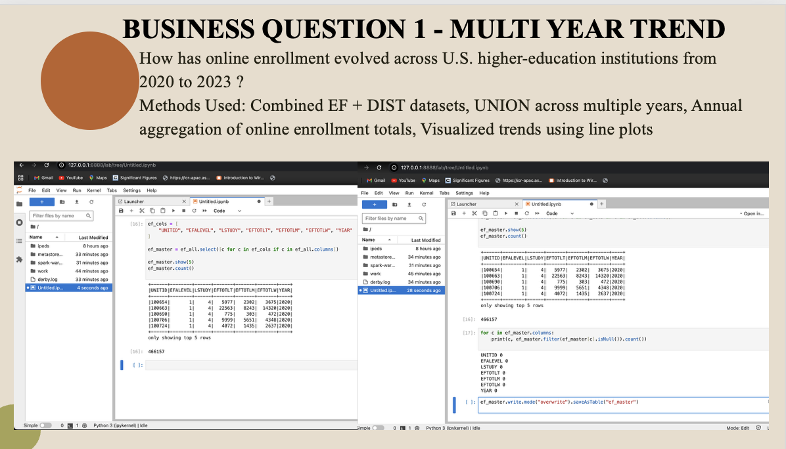
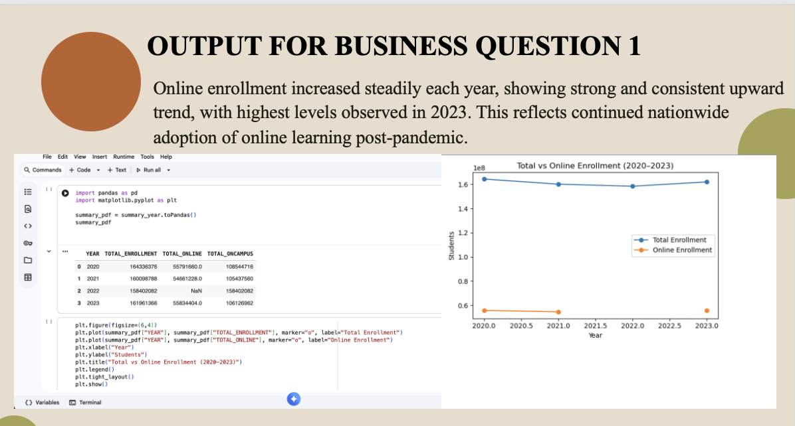
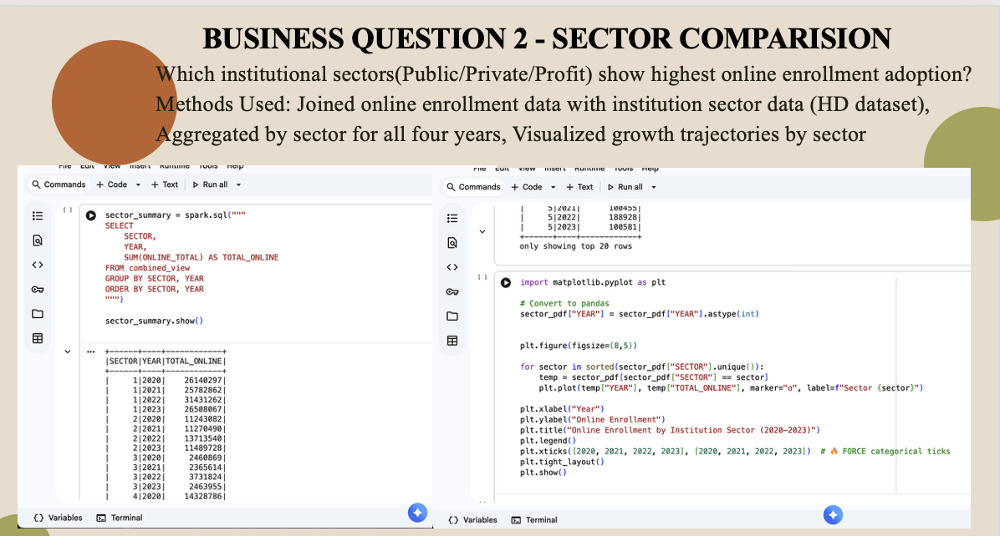
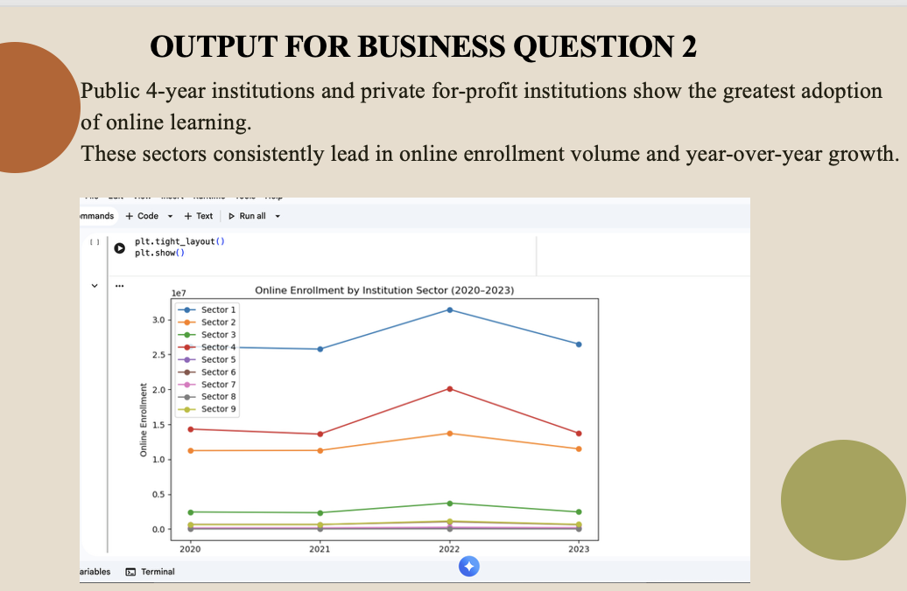
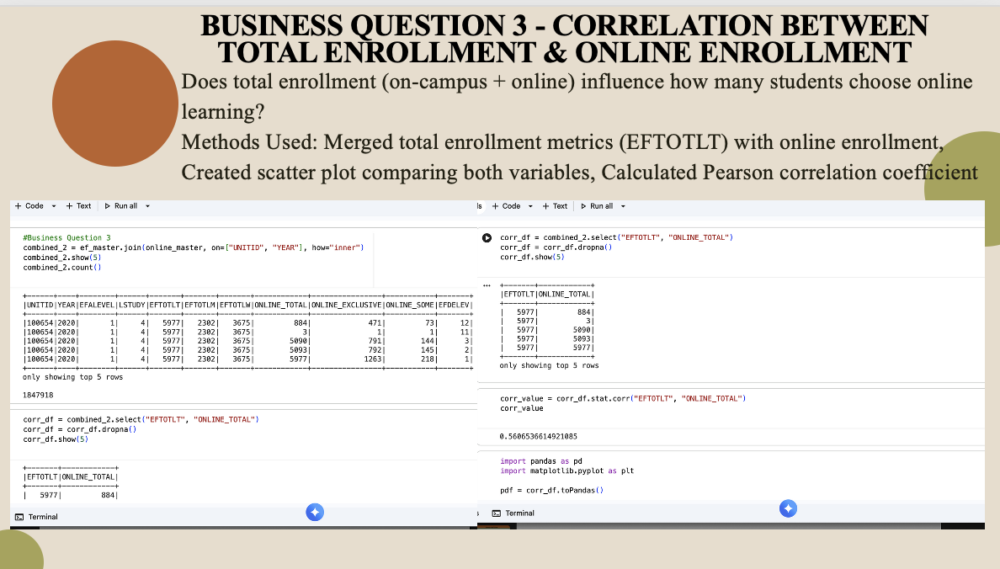
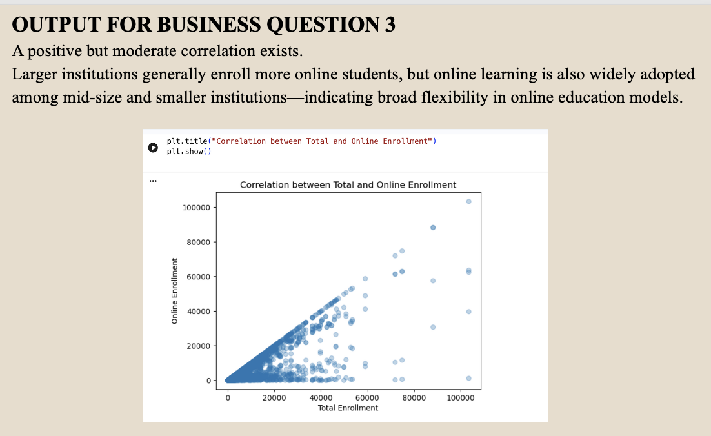

# IPEDS Big Data Analytics (2020–2023) — Spark • Hive • SQL

## Overview
IPEDS publishes multi-year higher education datasets that are large, wide, and inconsistent across years. This project builds a scalable analytics workflow using **Spark, Hive, and SQL** to ingest, clean, standardize, and analyze **2020–2023** IPEDS enrollment data and answer **three business questions (BQ1–BQ3)**.

## Objectives
- Build an end-to-end big data pipeline for multi-year IPEDS datasets
- Normalize schemas across years (handle missing/changed columns)
- Use Spark/Hive/SQL to answer BQ1–BQ3 with reproducible outputs
- Generate sector-wise insights on enrollment and online learning trends

---

## Quick Preview (Business Questions + Outputs)

  
  

  
  

  
  

---

## Dataset (Not Included)
The full IPEDS raw datasets are not included in this repository due to file size limitations.  
This repository contains the **analysis workflow + documented outputs** (screenshots, report, and pipeline explanation).

---

## Tools & Tech Stack
- **Spark (PySpark)**: distributed ingestion, schema normalization, joins, aggregations
- **Hive**: database + table management, SQL querying layer
- **SQL**: analytics queries to produce final results for BQ1–BQ3
- Optional: visualization/export of aggregated results for reporting

---

## Pipeline Summary (High Level)

### 1) Ingestion & Storage
- Downloaded/extracted multi-year IPEDS files (2020–2023)
- Loaded datasets into the processing environment (Spark container / cluster)
- Stored/managed large files using distributed storage practices

### 2) Schema Normalization (Critical for Multi-Year Data)
- Standardized column names and data types across years
- Handled year-to-year differences (missing/renamed fields)
- Combined yearly datasets using Spark (e.g., `unionByName`)

### 3) Processing & SQL Analytics
- Built consolidated “master” tables for analysis
- Performed joins and aggregations to answer business questions
- Produced final outputs and screenshots saved in `assets/`

---

## Business Questions (BQ) & Outputs

### BQ1 — Business Question 1

  

**Output**

  

---

### BQ2 — Business Question 2

  

**Output**

  

---

### BQ3 — Business Question 3

  

**Output**

  

---
